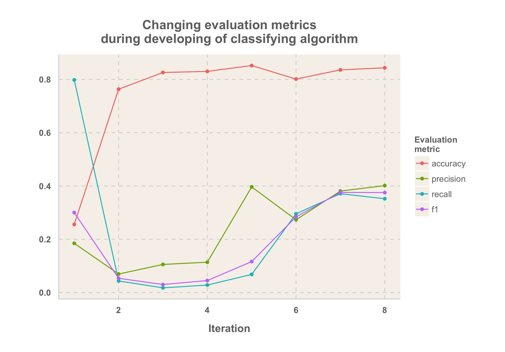

Enron Submission Free-Response Questions
==============

**1) Summarize the goal of this project and how machine learning is useful in trying to accomplish it.**

This project is a grading project for Udacity course "Introduction to Machine Learning". It deals with a dataset released in connection to famous Enron fraud scandal. Dataset contains information about key figures in Enron company at the time of that scandal, such as various compensation figures, data from email correspondence, etc. Goal of the project is to predict whether a person from dataset was convicted after fraud scandal or not using machine learning techniques.

Initial dataset has 21 various features about 146 persons from Enron. 18 of them are persons of interest, and 128 of them are not. Counts of missing values for each of dataset parameters are below:

Parameter | Number of missing data
----------|----------
bonus                      |   64
deferral_payments          |  107
deferred_income            |   97
director_fees              |  129
email_address              |   35
exercised_stock_options    |   44
expenses                   |   51
from_messages              |   60
from_poi_to_this_person    |   60
from_this_person_to_poi    |   60
loan_advances              |  142
long_term_incentive        |   80
other                      |   53
poi                        |    0
restricted_stock           |   36
restricted_stock_deferred  |  128
salary                     |   51
shared_receipt_with_poi    |   60
to_messages                |   60
total_payments             |  21
total_stock_value          |   20

**2) What features did you end up using in your POI identifier, and what selection process did you use to pick them?** 

In the beginning I used intuition to select features for my classifier. I started with 'total_payments' and 'from_poi_to_this_person', which produced reasonable accuracy but abysmal recall and precision. Then I decided to include all the features from the dataset. Additionally I added my own feature, share of bonus to total payments. 

Since features had vastly different scale, I implemented a min-max scaler using sklearn functions, with default parameters.  To select best features I used `SelectKBest()` function from sklearn package. I ended up using 5 features:
 
 FEATURE|SCORE
 --------|-------
 bonus|30.6522823057
 total_stock_value|10.8146348630
 shared_receipt_with_poi|10.6697373596
 exercised_stock_options|9.9561675821
 total_payments|8.9627155010
  
As we can see, most significant feature by far was size of bonus. Own feature did not make into the top 10 most significant features, it is 10th most significant feature according to SelectKBest() algorithm.

**3) What algorithm did you end up using? What other one(s) did you try? How did model performance differ between algorithms?**

I tried four different algorithms: 

* Naive Bayes
* Decision tree 
* Support Vector Machines with linear kernel
* Random forest.

Performance criterion is F1 score. Using 10 best features (selected with SelectKBest function), PCA and MinMax scaler, I got following F1 scores:
 
Algorithm | F1 score
----------|----------
Naive Bayes | 0.50
Decision tree | 0.18
SVM, linear kernel | 0.25
Random forest | 0.44

Naive Bayes and Random Forest algorithms performed best, while SVM with linear kernel and Decision tree showed significantly lower F1 scores.

**4) What does it mean to tune the parameters of an algorithm, and what can happen if you don’t do this well?  How did you tune the parameters of your particular algorithm?**

Some classification algorithm require arguments, that affect the training of that algorithm. Support vector machines can use various types of kernel (linear and rbf being the most popular choices). Using Decision tree algorithm one can change minimum amount of samples to be required to be in internal node. Changing these parsmeters can have enormous impact on classifuer's accuracy and other evaluation metrics.

However it turned out that in my algorithm Naive Bayes performed best. It does not have parameters to tune in. Instead I focused on tuning number of features to be included in dataset. I iterated over range of numbers from 2 to 17 (there are 17 features in initial dataset), calculated algorithm's F1 score on test part of initial dataset with Naive Bayes using SelectKBest function. It turned out that F1 score with 6 best features was maximum on tsplitted training set. Tester.py showed 0.4 precision and 0.35 recall, which also satisfies proejct requirements.
 
**5) What is validation, and what’s a classic mistake you can make if you do it wrong? How did you validate your analysis?**

Validation is a process of calculating efficiency of machine learning algorithm. Classic mistake here is that efficiency of that algorithm is evaluated on the same dataset that was used to train this algorithm.

I used a common approach in evaluating efficiency. I split dataset at my disposal into train and test datasets (test dataset contains 30% of all the row, remaining is a training dataset). I used training dataset to rain my algorithm, and test dataset to calculate its efficiency parameters.

**6) Give at least 2 evaluation metrics and your average performance for each of them.**

Changing in evaluation metrics over the course of algorithm development using `tester.py` is displayed on image below:

Here I plotted accuracy, precision, recall and F1 scores after each iteration of my classifier on set aside dataset used in `tester.py` script. Accuracy is simply share of correctly classified datapoints to overall number of datapoints. While it is simplest measurement, it is very deceiving for datasets with unequal distribution of labels. Indeed in this project on early stages accuracy was robust 82%, but algorithm was able to correctly identify persons of interest only 3 out of a 1968 times.

Better efficiency measurements are precision and recall, also plotted in image above. Precision is share of true positives to sum of true and false positives. It shows what is the share of persons of interest, identified correctly by algorithm to all the persons of interests, labelled by algorithm. 

Recall is share of true positives to sum of true positives and false negatives. In other words, it shows share of persons of interest correctly identified by algorithm to all the persons of interest in our dataset.
 
My final algorithm produced .85 accuracy, .4 precision and .35 recall with `tester.py` script.
