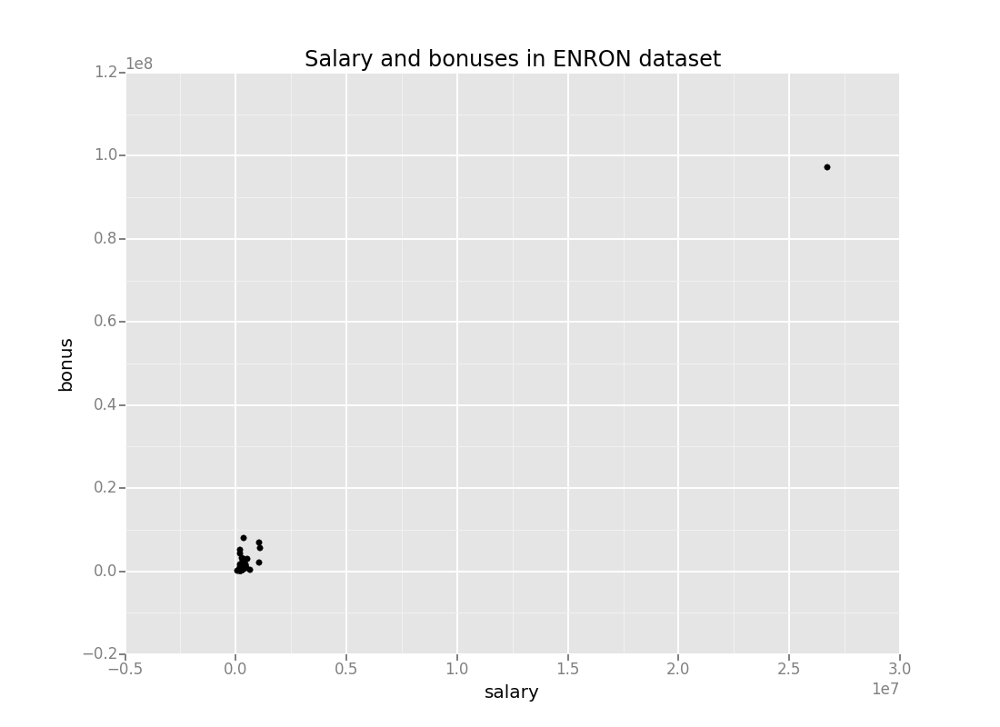

Enron Submission Free-Response Questions
==============

**1) Summarize the goal of this project and how machine learning is useful in trying to accomplish it.**

This project is a grading project for Udacity course "Introduction to Machine Learning". It deals with a dataset released in connection to famous Enron fraud scandal. Dataset contains information about key figures in Enron company at the time of that scandal, such as various compensation figures, data from email correspondence, etc. Goal of the project is to predict whether a person from dataset was convicted after fraud scandal or not using machine learning techniques.

Initial dataset has 21 various features about 146 persons from Enron. 18 of them are persons of interest, and 128 of them are not. Counts of missing values for each of dataset parameters are below:

Parameter | Number of missing data
----------|----------
bonus                      |   64
deferral_payments          |  107
deferred_income            |   97
director_fees              |  129
email_address              |   35
exercised_stock_options    |   44
expenses                   |   51
from_messages              |   60
from_poi_to_this_person    |   60
from_this_person_to_poi    |   60
loan_advances              |  142
long_term_incentive        |   80
other                      |   53
poi                        |    0
restricted_stock           |   36
restricted_stock_deferred  |  128
salary                     |   51
shared_receipt_with_poi    |   60
to_messages                |   60
total_payments             |  21
total_stock_value          |   20

Dataset has outliers as well, see picture below:

I decided to label outliers all the data points with salary larger than median salary by factor of 10 and more. It turned out there was only one such datapoint, labelled 'TOTAL'. Needless to say that I removed this point from dataset.

**2) What features did you end up using in your POI identifier, and what selection process did you use to pick them?** 

In the beginning I used intuition to select features for my classifier. I started with 'total_payments' and 'from_poi_to_this_person', which produced reasonable accuracy but abysmal recall and precision. Then I decided to include all the features from the dataset. Additionally I added my own feature, share of bonus to total payments, which I added after initial dataset is read. It is labelled `bonus_share`

Since features had vastly different scale, I implemented a min-max scaler using sklearn functions, with default parameters. 

After trial and error I decided to use a feature selection algorithm, as opposed to intuition. I used `SelectKBest()` function from sklearn package. I started with 10 features, and then used them when I selected which classifying algorithm to use. This process is described in section 3 more in detail.

After I figured out which algorithm to choose, I calculated F1 score for numbers of top features from 2 to 17, 17 being total number of features in initial dataset. It turned out that 6 best features provide best F1 score on test dataset. Their scores are in table below.
 
 FEATURE|SCORE
 --------|-------
 bonus|30.6522823057
 total_stock_value|10.8146348630
 shared_receipt_with_poi|10.6697373596
 exercised_stock_options|9.9561675821
 total_payments|8.9627155010
 deferred_income| 8.49
  
As we can see, most significant feature by far was size of bonus. My own feature, `bonus_share`, did not make into the top 6 most significant features, it is 10th most significant feature according to SelectKBest() algorithm.

**3) What algorithm did you end up using? What other one(s) did you try? How did model performance differ between algorithms?**

I tried four different algorithms: 

* Naive Bayes
* Decision tree 
* Support Vector Machines with linear kernel
* Random forest.

As I mentioned before, I used min-max scaler, PCA decomposition and selected top 10 features using `SelectKBest()` function. Selecting optimal number of features was performed after selecting classification algorithm, as described in section 2.

Following features were selected during determining best algorithm:

Feature|Score
--------|------
total_payments|8.96
total_stock_value|10.81
loan_advances|7.04
bonus|30.65
deferred_income|8.49
exercised_stock_options|9.96
long_term_incentive|7.53
restricted_stock|8.05
shared_receipt_with_poi|10.67
bonus_share|5.79

Performance criterion is F1 score, selected algorithms produced following scores on set-aside test dataset:
 
Algorithm | F1 score
----------|----------
Naive Bayes | 0.50
Decision tree | 0.18
SVM, linear kernel | 0.25
Random forest | 0.44

Naive Bayes and Random Forest algorithms performed best, while SVM with linear kernel and Decision tree showed significantly lower F1 scores.

Interestingly enough, my own feature, `bonus_share` was selected with `SelectKBest` function, using 10 features. However when I tuned number of features (see section 2 above), the number of features producing maximum F1 score turned out to be 6. These features excluded `bonus_share`. F1 score is 0.5 for 10 features, and 0.6 for 6 features (see section 6 for more informaiton about efficiency parameters).

**4) What does it mean to tune the parameters of an algorithm, and what can happen if you don’t do this well?  How did you tune the parameters of your particular algorithm?**

Some classification algorithm require arguments, that affect the training of that algorithm. Support vector machines can use various types of kernel (linear and rbf being the most popular choices). Using Decision tree algorithm one can change minimum amount of samples to be required to be in internal node. Changing these parameters can have enormous impact on classifier's accuracy and other evaluation metrics.

However it turned out that in my algorithm Naive Bayes performed best. It does not have parameters to tune in. Instead I focused on tuning number of features to be included in dataset.

Support vector machines is a great example of an algorithm with parameters often needed to be tuned. By far the most commonly tuned parameters are kernel and C param. Parameter `kernel` in  `sklearn.svm.SVC` module is a string, permitted values are 'linear', 'poly', 'rbf', 'sigmoid', 'precomputed'. Default value for this parameter is 'rbf'. This parameter determines shape of decision boundary.

Parameter `C` in this module is a number that specifies penalty for error term. It decides a tradeoff between complexity of decision boundary and correctness of classification.

To tune parameters of SVM algorithm I would use `sklearn.grid_search.GridSearchCV` module, or similar modules from sklearn. During this process I would construct list of C parameters (ex. [1, 10, 100, 1000, 10000]), and calculated evaluation parameter (F1, precision or recall) for every C parameter and possible SVM kernel.  
 
**5) What is validation, and what’s a classic mistake you can make if you do it wrong? How did you validate your analysis?**

Validation is a process of testing our classification algorithm using a real-life independent dataset. This is crucial to avoid overfitting and making sure that our classifying algorithm is usable in practical datasets. In case validation is not done, or done wrongly, the resulting classifying algorithm is very likely to perform poorly on practical datasets, other than the one used in training and evaluating phases.

I used a validation function supplied in the starter code. This function loads list of features, classification algorithm, and a dataset with own features and with no outliers. Then it calculates evaluation parameters: splits dataset into test and training dataset (training dataset is 30% of all the rows), trains algorithm on training dataset, predicts persons of interest on training dataset, compares predicted and actual labels, and records number of true and false positives, and true and false negatives. Splitting and predicting parameters is repeated 1000 times. At the end all prediction numbers are summaries accuracy, precision, recall and F1 score are calculated.

**6) Give at least 2 evaluation metrics and your average performance for each of them.**

Changing in evaluation metrics over the course of algorithm development using `tester.py` is displayed on image below:

Here I plotted accuracy, precision, recall and F1 scores after each iteration of my classifier on cross-validating algorithm with  `tester.py` script. Accuracy is simply share of correctly classified data points to overall number of data points. While it is simplest measurement, it is very deceiving for datasets with unequal distribution of labels. Indeed in this project on early stages accuracy was robust 82%, but algorithm was able to correctly identify persons of interest only 3 out of 1968 times.

Better efficiency measurements are precision and recall, also plotted in image above. Precision is share of true positives to sum of true and false positives. It shows what is the share of persons of interest, identified correctly by algorithm to all the persons of interests, labelled by algorithm. 

Recall is share of true positives to sum of true positives and false negatives. In other words, it shows share of persons of interest correctly identified by algorithm to all the persons of interest in our dataset.
 
My final algorithm produced following evaluation metrics on set-aside test set and during cross validation using `tester.py`:

Parameter|Test dataset|Cross validation, `tester.py`
---------|------------|----
ACCURACY |0.91        |0.85
PRECISION|0.60        |0.40
RECALL   |0.60        |0.35
F1 SCORE |0.60        |0.38
